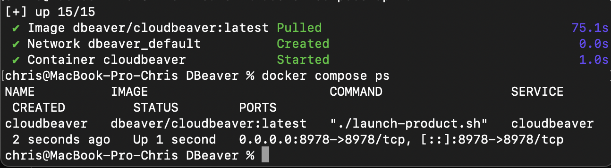
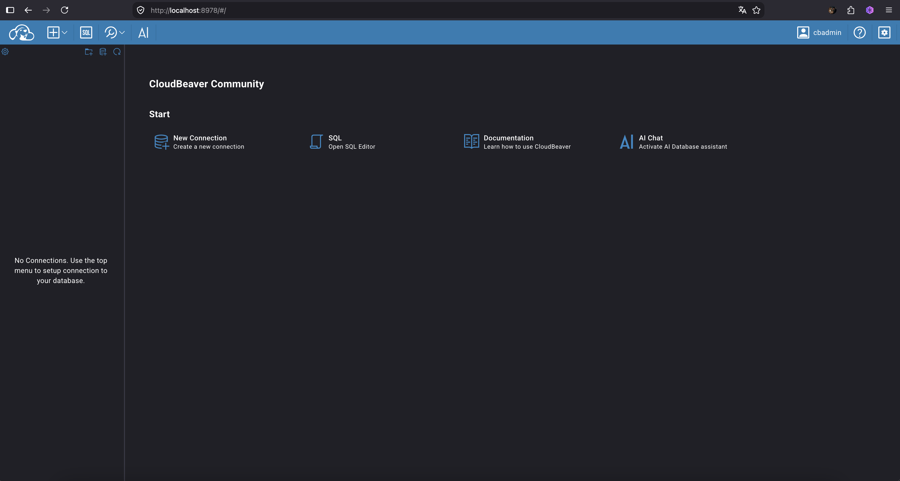
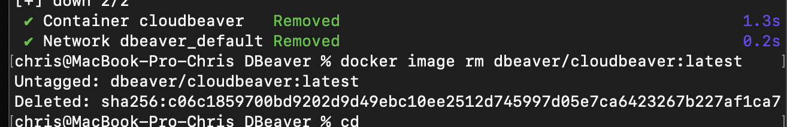

## Docker compose проект с CloudBeaver

В рамках этого задания был развернут **CloudBeaver** — современная веб-версия популярного инструмента **DBeaver**, предназначенная для удаленного администрирования и работы с базами данных прямо из браузера.

### 1. Запуск проекта
После создания конфигурационного файла `compose.yaml` проект был успешно запущен в фоновом режиме:
```bash
docker compose up -d

```

Проверка статуса подтвердила корректную работу сервиса.


**

---

### 2. Настройка и веб-интерфейс

В браузере по адресу `http://localhost:8978` была выполнена первичная настройка приложения, включая создание учетной записи администратора (`cbadmin`). Все подключения и конфигурации сохраняются в изолированном локальном томе (`./workspace`).


**

---

### 3. Остановка и очистка ресурсов

После завершения работы контейнеры, тома данных и скачанные образы были полностью удалены из системы:

```bash
docker compose down -v
docker image rm dbeaver/cloudbeaver:latest

```


**

```

---

### Финальный шаг
Перенеси скриншоты в папку репозитория, проверь оформление и отправь изменения на GitHub:
```bash
git add .
git commit -m "Transition stage"
git push

```