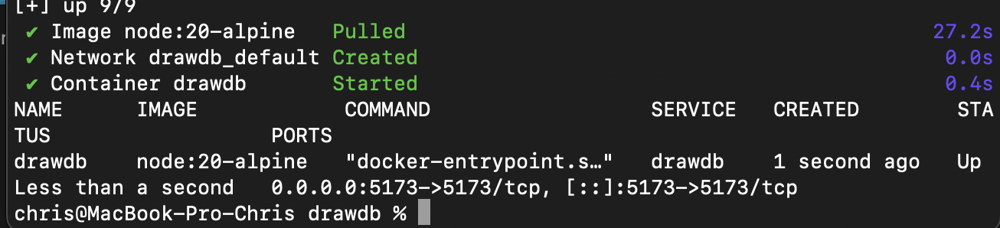
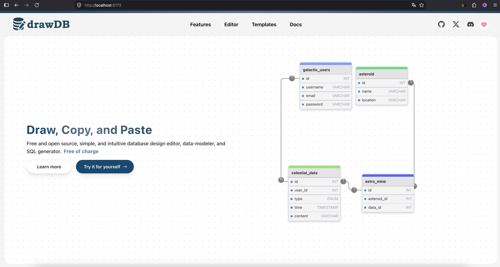
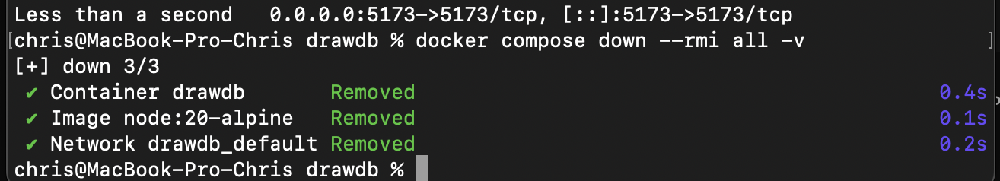

## Развертывание drawDB из стороннего репозитория

В рамках финального задания был успешно клонирован и запущен локально проект с открытым исходным кодом drawDB (инструмент для проектирования баз данных).

### 1. Клонирование и запуск
Репозиторий проекта был загружен напрямую с GitHub с помощью команды `git clone`. После перехода в директорию `drawdb` был выполнен запуск контейнеров в фоновом режиме:
```bash
docker compose up -d

```

Несмотря на то, что проекту потребовалось время на сборку, сервисы успешно перешли в статус работы.


**

---

### 2. Доступ к веб-интерфейсу

После полной инициализации контейнеров веб-интерфейс редактора drawDB стал доступен в браузере по адресу `http://localhost:5173`.


**

---

### 3. Полная очистка ресурсов

Для освобождения дискового пространства и портов системы, проект был остановлен с максимальной очисткой — удалением контейнеров, томов данных и скачанных образов (images):

```bash
docker compose down --rmi all -v

```

После успешной остановки локальная папка склонированного репозитория была полностью удалена с диска.


**

