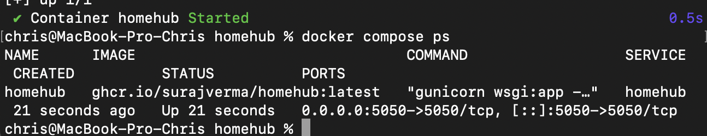
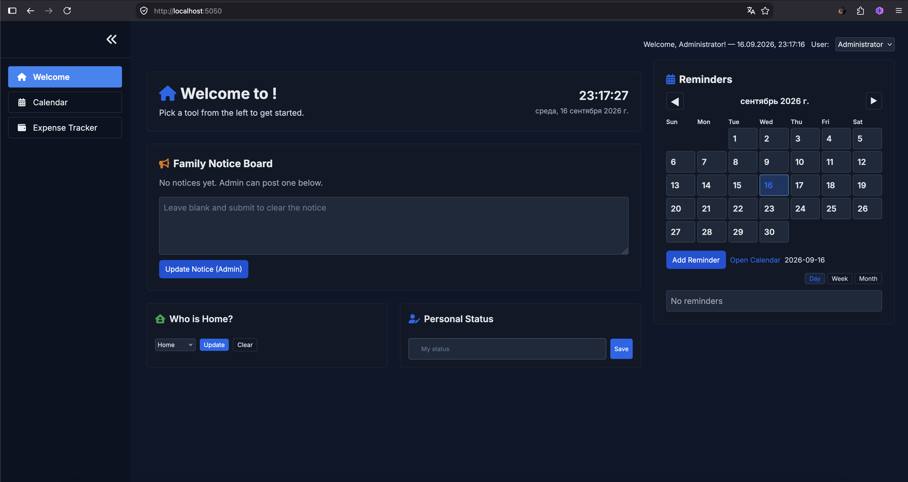

## Docker compose проект с HomeHub

В рамках этого практического задания был развернут **HomeHub** — универсальная семейная панель управления для организации совместных заметок, списков покупок, трекера расходов и медиафайлов в локальной сети.

### 1. Запуск проекта
После клонирования репозитория проект был успешно запущен в фоновом режиме с маппингом портов на хост-машину (`5050:5000`):
```bash
docker compose up -d

```

Проверка статуса контейнера подтвердила его корректную работу.


**

---

### 2. Веб-интерфейс HomeHub

Приложение успешно открылось в браузере по адресу `http://localhost:5050`, предоставив доступ к панели управления.


**

---

### 3. Остановка и очистка

После завершения работы контейнеры, тома данных и образы были полностью удалены из системы:

```bash
docker compose down --rmi all -v

```


**
