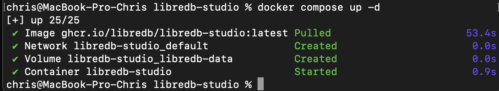
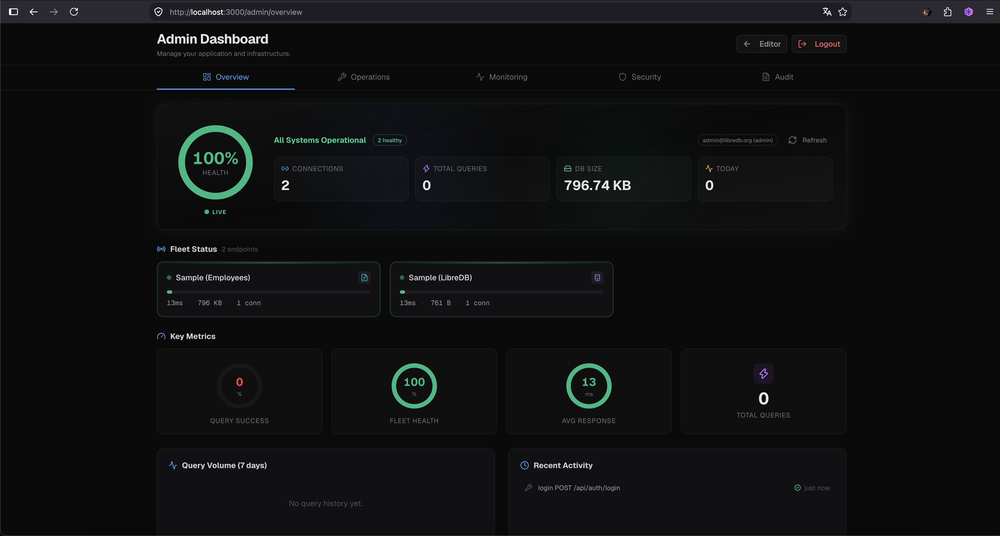
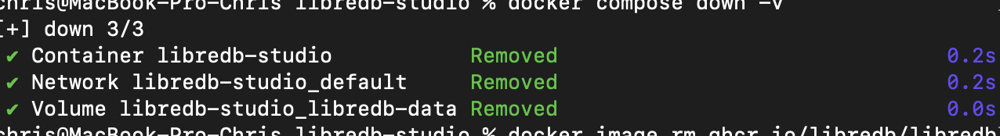

## Запуск LibreDB Studio через Docker Compose

В рамках этого задания была развернута современная веб-IDE для управления базами данных — **LibreDB Studio**, использующая конфигурацию с переменными окружения из файла `.env` и изолированное хранилище (volume).

### 1. Запуск проекта
После создания конфигурационного файла `compose.yaml` и файла с переменными окружения `.env` (содержащего учетные данные администратора и секретные ключи), проект был запущен в фоновом режиме:
```bash
docker compose up -d

```

Проверка статуса подтвердила успешный запуск сервиса.


**

---

### 2. Авторизация в веб-интерфейсе

Веб-интерфейс стал доступен по адресу `http://localhost:3000`. Был выполнен успешный вход в систему под учетной записью администратора (`admin@libredb.org`).


**

---

### 3. Остановка и очистка ресурсов

После завершения работы контейнеры и тома данных были корректно удалены, а скачанный Docker-образ был стерт с диска для экономии памяти:

```bash
docker compose down -v
docker image rm ghcr.io/libredb/libredb-studio:latest

```


**

```
