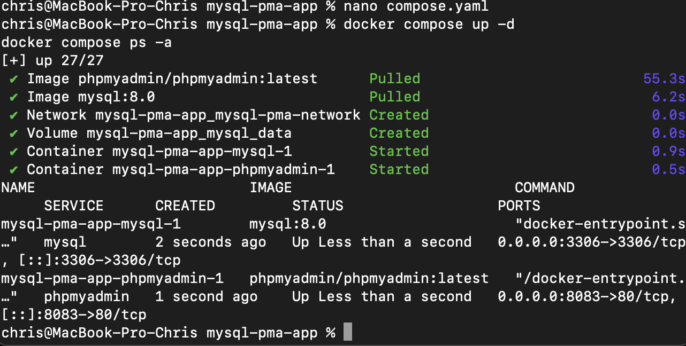
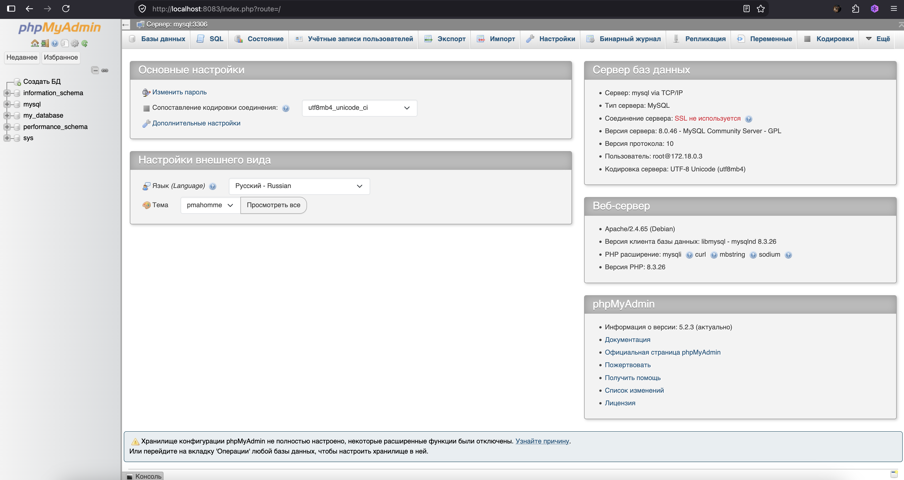
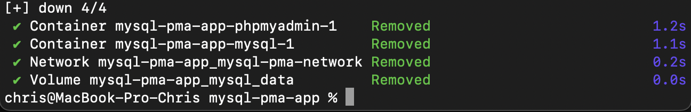

## Запуск MySQL и phpMyAdmin через Docker Compose

В рамках задания была развернута связка из базы данных MySQL и графического веб-интерфейса phpMyAdmin для удобного управления ею.

### 1. Запуск контейнеров
Был создан конфигурационный файл `compose.yaml` с настройками сервисов `mysql` и `phpmyadmin`. Проект запущен в фоновом режиме:
```bash
docker compose up -d

```

Статус работы контейнеров проверен. Оба сервиса успешно запущены и работают.


**

---

### 2. Подключение к базе данных через браузер

Интерфейс phpMyAdmin стал доступен по адресу `http://localhost:8083`. Был выполнен успешный вход под пользователем `root`.


**

---

### 3. Остановка проекта

После завершения работы проект был остановлен с удалением всех связанных данных (volumes), чтобы избежать конфликта портов с другими проектами:

```bash
docker compose down -v

```


**

```

