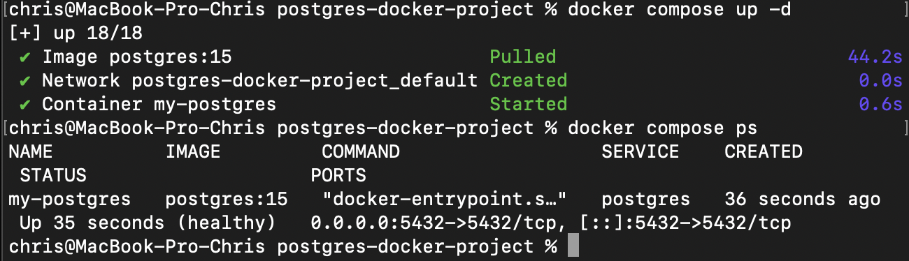
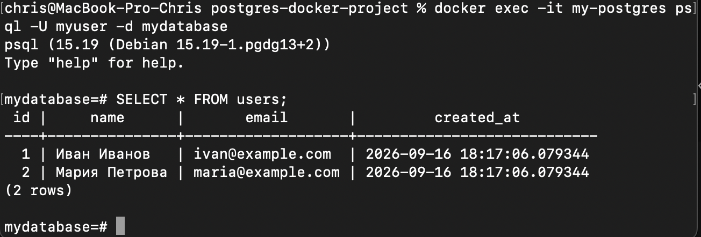

## Запуск PostgreSQL через Docker Compose

В рамках практической работы была развернута база данных PostgreSQL (версия 15) с использованием заранее подготовленного скрипта инициализации `init.sql`.

### 1. Запуск контейнеров
Был создан конфигурационный файл `docker-compose.yml` с настройками проброса портов, томов (volumes) и проверкой состояния (healthcheck). Проект запущен в фоновом режиме:
```bash
docker compose up -d

```

Статус работы контейнеров успешно проверен.


**

---

### 2. Подключение к базе данных и проверка

Поскольку PostgreSQL не имеет встроенного веб-интерфейса, подключение к работающей базе данных было осуществлено напрямую через терминал:

```bash
docker exec -it my-postgres psql -U myuser -d mydatabase

```

Проверено успешное выполнение скрипта инициализации. В таблице `users` успешно созданы тестовые записи.


**

---

### 3. Остановка проекта

После завершения работы проект был полностью остановлен с удалением всех связанных данных (volumes), сетей и контейнеров:

```bash
docker compose down -v

```


**

```
