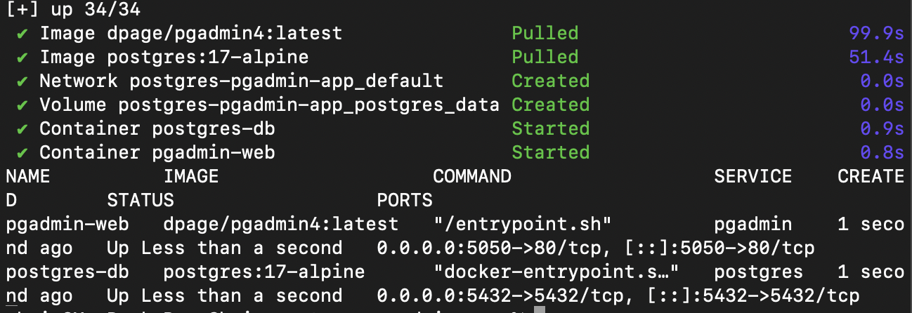
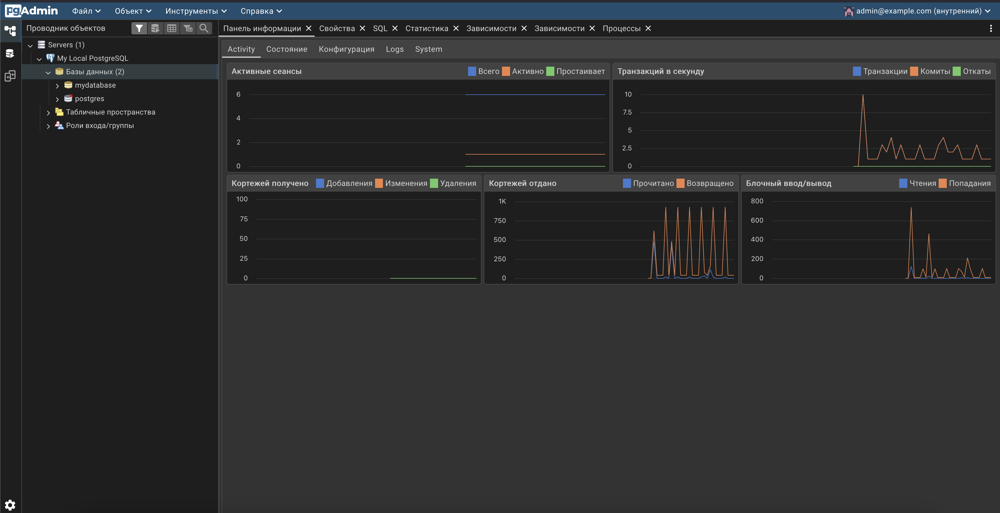
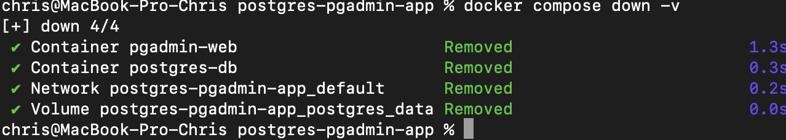

## Запуск PostgreSQL и pgAdmin через Docker Compose

В рамках финального задания была развернута связка из базы данных PostgreSQL и графического веб-интерфейса pgAdmin для удобного визуального администрирования.

### 1. Запуск контейнеров
Был создан конфигурационный файл `compose.yaml`, описывающий два сервиса: `postgres` и `pgadmin`. Проект запущен в фоновом режиме командой:
```bash
docker compose up -d

```

Статус работы проверен: оба контейнера успешно стартовали.


**

---

### 2. Подключение к базе данных через браузер

Интерфейс pgAdmin стал доступен по адресу `http://localhost:5050`. Было выполнено успешное подключение к серверу базы данных `postgres-db`. База данных `mydatabase` корректно отображается в панели управления.


**

---

### 3. Корректная остановка проекта

После завершения работы проект был полностью остановлен с удалением всех связанных данных (volumes), чтобы избежать конфликта портов в будущем:

```bash
docker compose down -v

```


**

```
