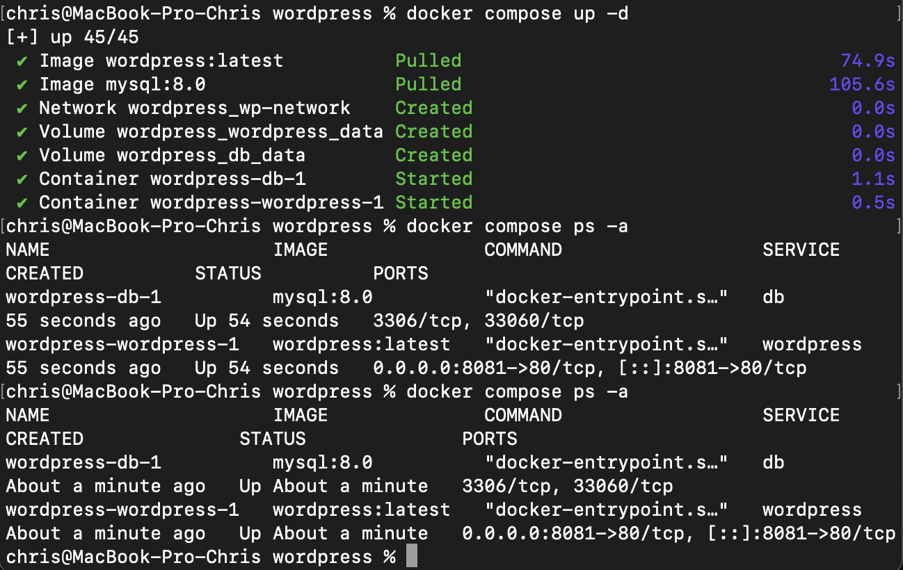
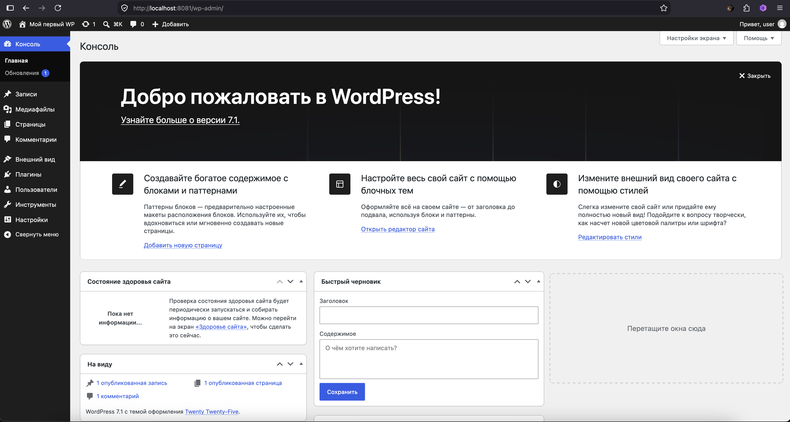
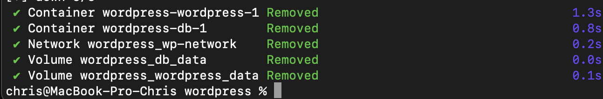

## Запуск CMS WordPress через Docker Compose

В рамках практической работы был успешно развернут проект с использованием WordPress и базы данных MySQL.

### 1. Подготовка и запуск контейнеров
Был создан каталог `wordpress` и конфигурационный файл `compose.yaml`. Запуск сервисов в фоновом режиме осуществлен командой:
```bash
docker compose up -d

```

Статус работы контейнеров проверен командой `docker compose ps -a`. Оба сервиса (`db` и `wordpress`) успешно запущены.


*()*

---

### 2. Установка и проверка работы сайта

После запуска контейнеров, сайт стал доступен по адресу `http://localhost:8081`. Была произведена базовая настройка CMS (создание администратора, привязка базы данных).

Сайт функционирует корректно:


**

---

### 3. Корректная остановка проекта

Для освобождения ресурсов системы и во избежание конфликтов портов в будущем, проект был полностью остановлен с удалением созданных томов (данных):

```bash
docker compose down -v

```




```

